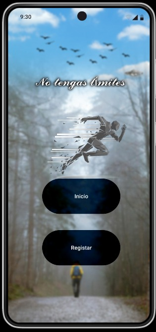

# Prototipo hecho en Figma
https://www.figma.com/proto/1TA5g2qZX56nBzce8tjKSD/Untitled?node-id=3-64&node-type=FRAME&t=lhDqQaMs4YEpqKrc-0&scaling=scale-down&content-scaling=fixed&page-id=0%3A1&starting-point-node-id=3%3A64
# Inicio de aplición

# Registro

# Gracias por registrarte

# Login

# Pantalla principal

# Distancia

# Estadistica

